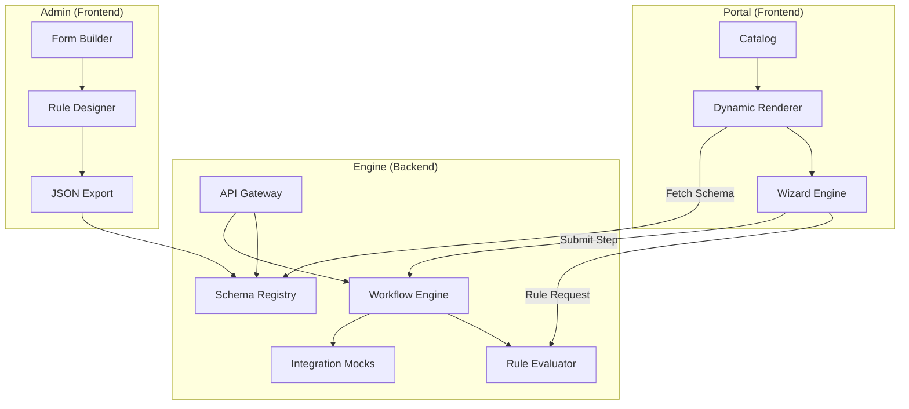

# Архитектура EPPB (Unified Business Support Portal)

## 1. Логическая архитектура (3-слойная модель)

Платформа построена на принципе **Data-Driven UI**, где Backend является единственным источником истины для структуры интерфейса и бизнес-логики.

### Слой 1: Builder Layer (Admin System)
*   **Service Designer:** Интерфейс метаданных услуги.
*   **Form Constructor:** Редактор полей с поддержкой типов данных (string, number, date, file, select) и валидаций.
*   **Workflow Editor:** Визуальный конструктор графа переходов между шагами. Позволяет задавать условия (Rules) на основе введенных данных.
*   **Schema Publisher:** Система контроля версий схем.

### Слой 2: Execution Layer (Backend Engine)
*   **Workflow Engine:** Движок состояний (State Machine), управляющий переходами заявки.
*   **Rule Evaluator:** Интерпретатор логических выражений (например, `total_cost > 5000000`).
*   **State Store:** Хранилище текущего состояния каждой сессии подачи заявки (drafts).
*   **Integration Adapter:** Абстракция над внешними сервисами (eGov, ГБД, КЦЭ) для получения данных "на лету" (например, предзаполнение по БИН).

### Слой 3: Portal Layer (End-User Experience)
*   **Dynamic Wizard:** Рендерер, строящий форму на базе JSON. Поддерживает динамическую видимость полей.
*   **Validation Controller:** Клиентская валидация по правилам из JSON (Regex, Required, Min/Max).
*   **Submission Tracker:** Личный кабинет пользователя с визуализацией прогресса по заявке.

---

## 2. Схема взаимодействия (Component View)



---

## 3. Расширенная JSON-схема (Core Entity)

Схема поддерживает вычисляемые поля и сложные переходы.

```json
{
  "serviceCode": "leasing-transport",
  "version": "2.0.0",
  "config": {
    "allowDrafts": true,
    "integrationRequired": ["egov-company-info"]
  },
  "steps": [
    {
      "id": "step_1",
      "title": "Идентификация",
      "fields": [
        {
          "id": "bin",
          "type": "string",
          "label": "БИН компании",
          "validation": { "pattern": "^\\d{12}$", "required": true },
          "triggers": ["fetchCompanyData"]
        },
        {
          "id": "company_name",
          "type": "string",
          "label": "Наименование",
          "disabled": true
        }
      ],
      "transitions": [
        { "to": "step_2", "condition": "always" }
      ]
    },
    {
      "id": "step_2",
      "title": "Детали сделки",
      "fields": [
        { "id": "cost", "type": "number", "label": "Стоимость активов" },
        { 
          "id": "tax_amount", 
          "type": "calculated", 
          "formula": "data.cost * 0.12",
          "label": "НДС (12%)"
        }
      ],
      "transitions": [
        { "to": "step_3_audit", "condition": "data.cost > 50000000" },
        { "to": "step_4_docs", "condition": "data.cost <= 50000000" }
      ]
    }
  ]
}
```
